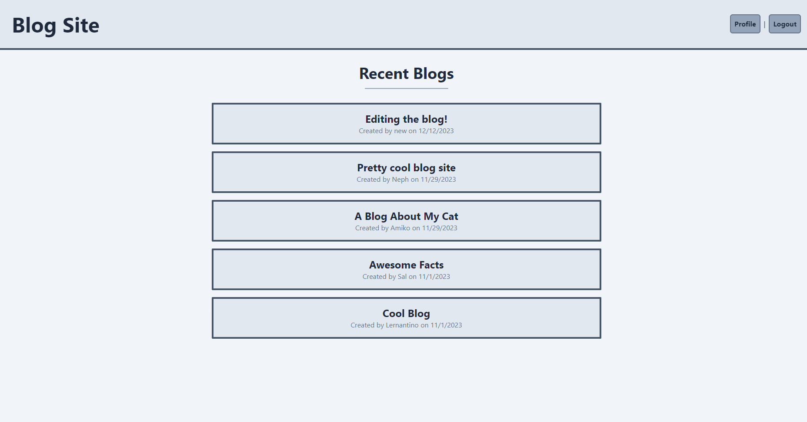

# Blog Site (Module 14 Challenge)

[](https://opensource.org/licenses/MIT)

A simple blog site made using handlebars.js, tailwind, express and mySQL.

## Table of Contents

- [Installation](#installation)
- [Usage](#usage)
- [Credits](#credits)
- [License](#license)
- [Questions and Contact](#questions-and-contact)

## Installation

An installation is not necessary as the site is hosted [here.](https://polar-waters-51648-c4b3a9caa9ef.herokuapp.com)

If you are still interested in running the code locally, follow the instructions below.

1. Clone the repository to your local machine.

   ```bash
   git clone <repository_url>
   cd <project_directory>
   ```

2. Install the project's dependencies by running:

   ```bash
   npm install
   ```

3. Make sure you have mySQL installed on your machine, login to mySQL CLI, and create the database. 

    *You need to make sure you either create a **.env** file and match the correct values in **connection.js**, or you can just set your mySQL information in **connection.js** directly.*

   ```bash
   mysql -u 'username' -p
   ```

   ```mysql
   source db/schema.sql
   ```

   ```bash
   node seed/seeds.js
   ```


## Usage

Once you have setup the database and 

1. Run the server with node using

   ```bash
   node server.js
   ```

2. Head to http://localhost:3001, create an account and start blogging!

### Screenshot




## Credits

N/A

## License

This project is licensed under the terms of the [MIT License](https://opensource.org/licenses/MIT).

You can find the full license text in the [LICENSE](LICENSE) file.

## Questions and Contact

Thank you for checking out the project!

If you have any questions or need further assistance with this project, feel free to reach out. You can contact me through the following methods:

- **GitHub Issues**: Please use the Github Issue Tracker for bug reports, feature requests, or general questions related to the project. You can find my Github profile @[nephh](https://github.com/nephh)